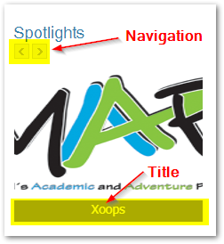
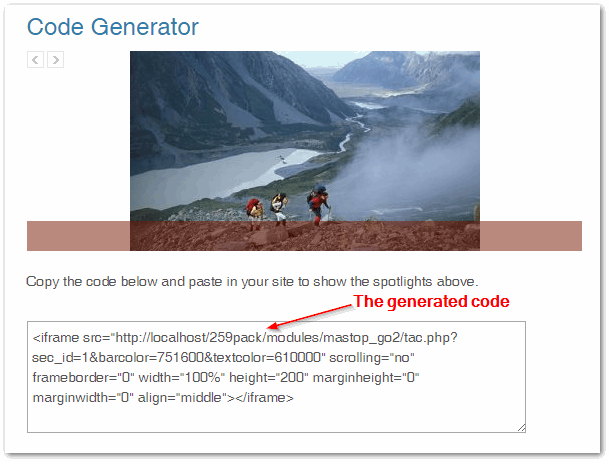

# 5.0 The User Side

The content of the spotlights will be visible in the Mastop\_Go2 block.

As Admin, if you like Mastop Go2 and its flexibility you still can add spotlights in any part of the site: Inside Mastop Publish, news, articles or even in the header of your theme.

At the index page at Mastop Go2 is a code generator that allows your spotlights to be in any addresses with no need to use the module or even xoops. The code generator is very useful to help promote your site.

Once you click on the button to generate the code, the system will create for you code that you can use in other parts of your XOOPS Website: 

